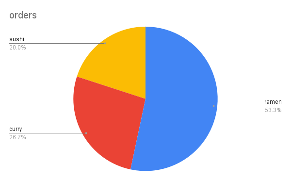

# 🍽️ Danny's Diner SQL Case Study

This project is part of the [8-Week SQL Challenge](https://8weeksqlchallenge.com/) by Data With Danny. I focused on the first five questions using SQL queries to uncover insights that could help improve customer retention and drive revenue growth.

---

## 📊 Objectives

Using SQL, I answered the following business questions and analyzed the results to identify opportunities for enhancing customer loyalty and boosting sales.

### ✅ Core Questions
<details><summary><strong>1. What is the total amount each customer spent at the restaurant?</strong></summary>
  
  ```sql
  SELECT
    s.customer_id,
    SUM(m.price) AS total_spent
  FROM sales s
  JOIN menu m ON s.product_id = m.product_id
  GROUP BY s.customer_id;
  ```
## Insights
**🔍 How I Solved It:**
- I joined the `sales` and `menu` tables using `product_id` to access the item prices.
- Then, I used `SUM()` to calculate the total amount each customer spent.

**📈 Why It Matters:**
- This query reveals the total spending per customer.
- Customers who spend the most are strong candidates for **loyalty programs, personalized offers**, or **VIP engagement strategies** and other loyalty rewards at the restaurant.
</details>

<details><summary><strong>2. How many days has each customer visited the restaurant?</strong></summary>
	
```sql
SELECT
   customer_id,
   COUNT(DISTINCT order_date)
FROM sales
GROUP BY customer_id
```
## Insights
**🔍 How I Solved It:**
- The most important function here is `COUNT(DISTINCT order_date)` as it will show exactly how many times each customer (A,B,C) have visited the restaurant without cluttering the data table.
- Customer B visited most frequently.

**📈 Why It Matters:**
- it can help identify which menu items or patterns are encouraging repeat visits.
- This insight could support **customer loyalty strategies** or **menu adjustments** based on returning behavior. The next few questions will be used to cross-reference and better understand what drives the customer loyalty.
</details>

<details><summary><strong>3. What was the first item from the menu purchased by each customer?</strong></summary>

```sql
WITH CTE AS(
SELECT
    customer_id,
    order_date,
    product_name,
ROW NUMBER() OVER(PARTITION BY customer_id ORDER BY order_date ASC) AS row_num
FROM sales
INNER JOIN menu on sales.product_id = menu.product_id)
SELECT *
FROM CTE
WHERE rank = 1
```
## Insights
**🔍 How I Solved It:**
- Using `ROW NUMBER()` allows me to retrieve exactly 1 item per customer.
- The `ORDER BY` function allows me to see what the customer ordered on the first date they came in.

**📈 Why It Matters:**
- This information is important in identifying what items drew the customer to the restaurant in the first place
- These “first impression” dishes could be promoted to new customers or highlighted in marketing campaigns to **boost first-time engagement**.
</details>

<details><summary><strong>4. What is the most purchased item on the menu and how many times was it purchased by all customers?</strong></summary>

```sql
SELECT product_name,
COUNT(order_date) as orders
FROM sales
INNER JOIN menu on sales.product_id = menu.product_id
GROUP BY product_name
ORDER BY COUNT(order_date) DESC
LIMIT 1
```
## Insights
**🔍 How I Solved It:**
- Using the `COUNT` function in the query, I was able to quantify each time the menu item was ordered as a single number.
- `INNER JOIN` was used to combine the product_id on the menu with the amount of sales. Thus, using the `COUNT` function at the end of the query shows how many times each menu item was purchased.

**📈 Why It Matters:**
- In this restaurant the most purchased item was ramen.
- This information helps identify the **most popular menu items**, which can be leveraged to **improve customer retention**. Marketing strategies can then be tailored to promote these high-performing items and **encourage repeat visits**.
</details>

<details><summary><strong>5. Which item was the most popular for each customer?</strong></summary>

```sql
WITH CTE AS(
SELECT 
    product_name,
    customer_id,
COUNT(order_date) as orders,
RANK() OVER(PARTITION BY customer_id ORDER BY COUNT(order_date) DESC)
FROM sales
INNER JOIN menu on sales.product_id = menu.product_id
GROUP BY 
    product_name,
    customer_id
)
SELECT
    customer_id,
    product_name
FROM CTE
WHERE rank=1
```
## Insights
**🔍 How I Solved It:**
- This query builds on the previous one to identify the most frequently purchased item for each customer.
- It uses `RANK()` to rank each menu item by purchase count per customer and filters to only include those with `rank = 1`.
  
**📈 Why It Matters:**
- This reveals customer preferences, which can inform **personalized marketing** or menu optimization strategies.
- These insights can support initiatives like **customer segmentation** or targeted offers based on purchase behavior.
</details>

---

## 🧠 Key Insights
- The most popular menu item at the restaurant is ramen. This insight can be used to design targeted promotions, such as featuring ramen in **loyalty rewards** or **new customer offers**, to drive both retention and acquisition.
- Customer B has returned to the restaurant the most amount of times while Customer A has the highest total spend. Even though Customer B has a preference for the curry, ramen remains the most purchased item. These insights suggest that targeted promotions based on **individual preferences**—rather than a one-size-fits-all approach—could **improve customer engagement and loyalty**.

---
## Visualizations
**Most Popular Menu Item**




---

## 🛠️ Tools Used

- **SQL** – Window functions, joins, aggregations
- **DB-Fiddle SQL Editor** – To run and test queries
- **Google Sheets / Excel** – For basic visualizations

---

## Conclusion
- This project showcases the SQL and data analysis skills I developed through the Google Coursera Data Analytics course.
- I applied key concepts such as joins, window functions, and aggregations to solve real-world business questions.
- This exercise improved my ability to communicate data-driven recommendations clearly and effectively.
